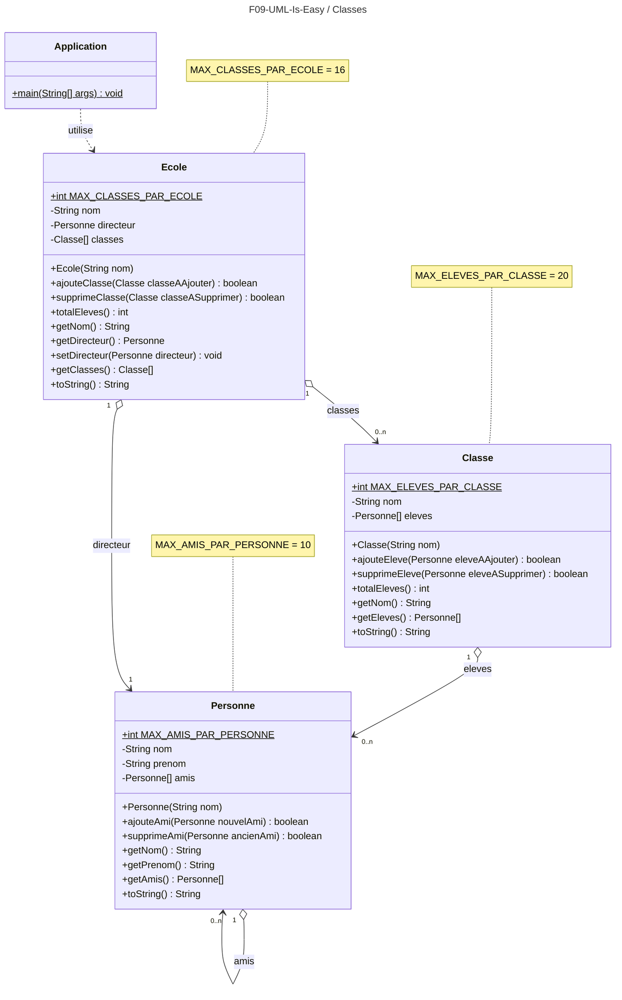

# Devoir 09 : UML-Is-Easy
Exercice de lecture et retranscription en Java d'informations fournies en UML.
## CONSIGNE :
- Regardez avec attention les schémas UML fournis ci-dessous.
- Retranscrivez ceux-ci avec précision en Java afin d'obtenir une application fonctionnelle.

Vous devriez obtenir une sortie console telle que celle-ci :
````
Blablabla bla bla bla.
Blablabla bla bla bla.
Blablabla bla bla bla.
````
# UML :
## Diagramme des classes de l'application

## Diagramme de séquence du main() de l'application :
```mermaid
---
title: F09-UML-Is-Easy / Séquence du main()
---
sequenceDiagram
main()->>Ecole emf : <<creation>>
main()->>Classe classeInfo : <<creation>>
main()->>Classe classeMatu : <<creation>>
main()->>Personne directrice : <<creation>>
main()->>Personne jean : <<creation>>
main()->>Personne jacques : <<creation>>
main()->>Personne julien : <<creation>>
main()->>+Ecole emf : setDirecteur(directrice)
main()->>+Ecole emf : ajouteClasse(classeInfo)
Ecole emf-->>-main(): ajoutOK
alt ajoutOK == true
      main()->>+Ecole emf : ajouteClasse(classeMatu)
      Ecole emf-->>-main(): ajoutOK
      alt ajoutOK == true
            main()->>+Classe classeInfo : ajouteEleve(jean)
            Classe classeInfo-->>-main(): ajoutOK1
            main()->>+Classe classeInfo : ajouteEleve(jacques)
            Classe classeInfo-->>-main(): ajoutOK2
            main()->>+Classe classeMatu : ajouteEleve(jean)
            Classe classeMatu-->>-main(): ajoutOK3
            main()->>+Classe classeMatu : ajouteEleve(julien)
            Classe classeMatu-->>-main(): ajoutOK4
                  
            alt ( ajoutOK1 == true ) ET ( ajoutOK2 == true ) ET ( ajoutOK3 == true ) ET ( ajoutOK4 == true )
                  main()->>+Personne jean : ajouteAmi(julien)
                  Personne jean-->>-main(): ajoutOK
                  alt ajoutOK == true
                        main()->>+Personne john : ajouteAmi(julien)
                        Personne john-->>-main(): ajoutOK
                        alt ajoutOK == true
                              main()->>+Personne directrice : ajouteAmi(jacques)
                              Personne directrice-->>-main(): ajoutOK
                              alt ajoutOK == true
                                    main()->>System.out : println("---------------------------------")
                                    main()->>System.out : println("L'école " + emf.getNom() + " contient les classes suivantes :")
                                    main()->>+Ecole emf : getClasses()
                                    Ecole emf-->>-main(): classesEMF
                                    
                                    loop FOR EVERY classe IN classesEMF NOT NULL
                                       main()->>System.out : println(classe.getNom())
                                    end

                              else
                                 main()->>System.err : println("La directrice n'a pas pu ajouter Jacques comme ami !")
                              end
                        else
                           main()->>System.err : println("John n'a pas pu ajouter Julien comme ami !")
                        end
                  else
                     main()->>System.err : println("Jean n'a pas pu ajouter Julien comme ami !")
                  end
            else
               main()->>System.err : println("Les élèves n'ont pas pu être ajoutés dans les classes!")
            end
      else
         main()->>System.err : println("La classe matu n'a pas pu être ajoutée !")
      end
else
   main()->>System.err : println("La classe info n'a pas pu être ajoutée !")
end
````


## RESTITUTION :
1. Rendre ce devoir normalement par `push` GitHub
