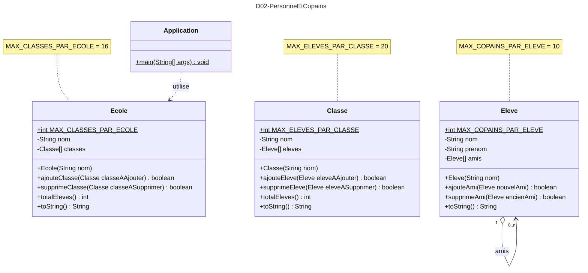

# Devoir 09 : UML-Is-Easy
Exercice de lecture et retranscription en Java d'informations fournies en UML.
## CONSIGNE :
- Regardez avec attention les schémas UML fournis ci-dessous.
- Retranscrivez ceux-ci avec précision en Java afin d'obtenir une application fonctionnelle.

Vous devriez obtenir une sortie console telle que celle-ci :
````
Blablabla bla bla bla.
Blablabla bla bla bla.
Blablabla bla bla bla.
````
# UML :
Ci-dessous le diagramme de classes UML pour l'ensemble de ce programme  :


## RESTITUTION :
1. Rendre ce devoir normalement par `push` GitHub
